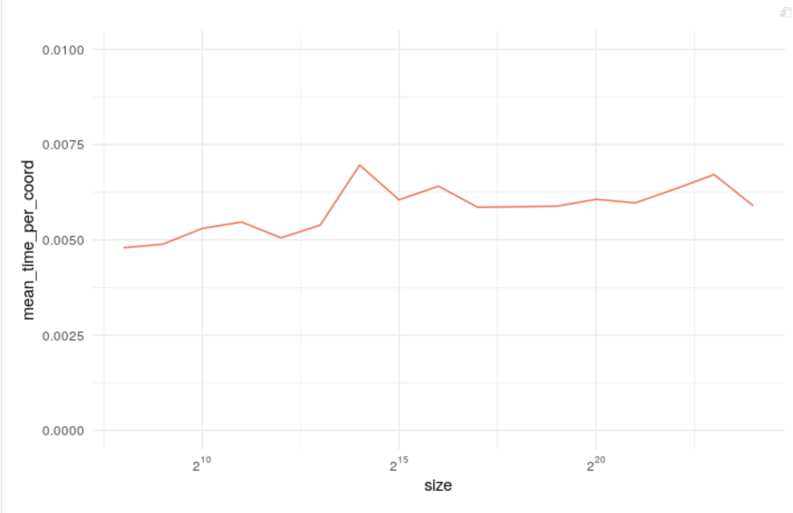
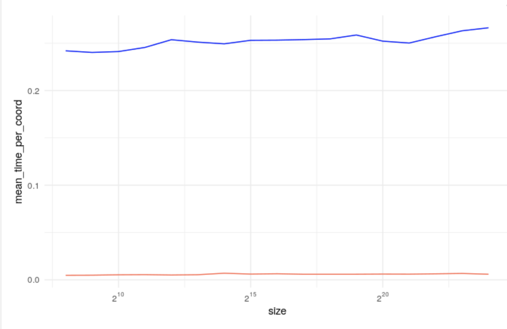
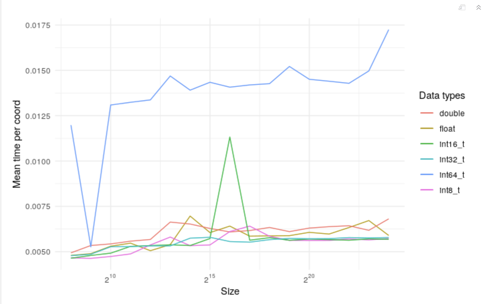

# HW0: Galaxy Explorers

The code for this homework is stored in `update_locations.py` (Python) and `update_locations.cpp` (C++).

To compile the C++ code, run the following command in the terminal:

```
g++ -std=c++17 -o prog update_locations.cpp
```
Then run the program:

```
./prog
```

## Part 1

Size | Iterations | Mean Time Per Coord.
-----|------------|--------------------
2^8 | 100000 | 0.24201684246093752
2^9 | 50000 | 0.24031535527343756
2^10 | 25000 | 0.24124512625
2^11  | 12500 | 0.24561360773437496
2^12 | 6250 | 0.2537666150390625
2^13 | 3125 | 0.25121013992187496
2^14 | 1562 | 0.24941853709593315
2^15 | 781 | 0.2531296116710472
2^16 | 390 | 0.25329827184518444
2^17 | 195 | 0.25387489174084793
2^18 | 97 | 0.2546242102396858
2^19 | 48 | 0.258737538576126
2^20 | 24 | 0.25223665022850034
2^21 | 12 | 0.2502510360479354
2^22 | 6 | 0.256928785363833
2^23 | 3 | 0.26317977058887493
2^24 | 1 | 0.26637958663702

a. I picked 10^5 as the number of iterations starting at the smallest size (2^8), and as the object count doubles, I halved the number of iterations, until I reached 1 for the largest size (2^24). I arrived at these numbers as I wanted to keep the `mean_time_per_coord` fairly consistent between each run.

b. I modified the `update_locations.py` file to evaluate the program for 10 consecutive runs and compute the average as the final measurement number. I wanted to see how the program performed on average.

c. 
Graph of Python performance

## Part 2

Size | Iterations | Mean Time Per Coord.
-----|------------|--------------------
2^8 | 100000 | 0.00479346
2^9 | 50000 | 0.0048871
2^10 | 25000 | 0.00529965
2^11  | 12500 | 0.00546853
2^12 | 6250 | 0.00505393
2^13 | 3125 | 0.00538805
2^14 | 1562 | 0.0069641
2^15 | 781 | 0.00605142
2^16 | 390 | 0.00640982
2^17 | 195 | 0.00585543
2^18 | 97 | 0.00587041
2^19 | 48 | 0.00588231
2^20 | 24 | 0.00606514
2^21 | 12 | 0.00597188
2^22 | 6 | 0.00633194
2^23 | 3 | 0.00671583
2^24 | 1 | 0.00589377

The C++ code runs about 50 times faster than the Python implementation. The graph below compares the running time between the two versions for the same benchmarks.



## Part 3

The graph below compares the C/C++ implementation using different C types: `float, double, int8_t, int16_t, int32_t, int64_t` for the coordinate and velocity types in terms of performance. `int64_t` has the worst performance, as its running time roughly triples the rest. The other data types have comparable performances.



## Part 4

I used the `/usr/bin/time -p` command to measure memory usage of the C++ program for 2^20 objects for 100 iterations across various data types. I recorded the first metric (`real`), which indicates the total time spent executing the script (in seconds). I defined the time a program occupies the memory as the memory usage of that program.

Data type | Memory usage (C++)
----------|------------
float | 6.72
double  | 7.35
int64_t |  6.93
int32_t | 6.81
int16_t | 6.36
int8_t | 6.44

The Python program ran for 291.86 seconds which is about 50 times slower than the C++ version. This is consistent with my previous finding using `mean_time_per_coord` as the measurement metric.
