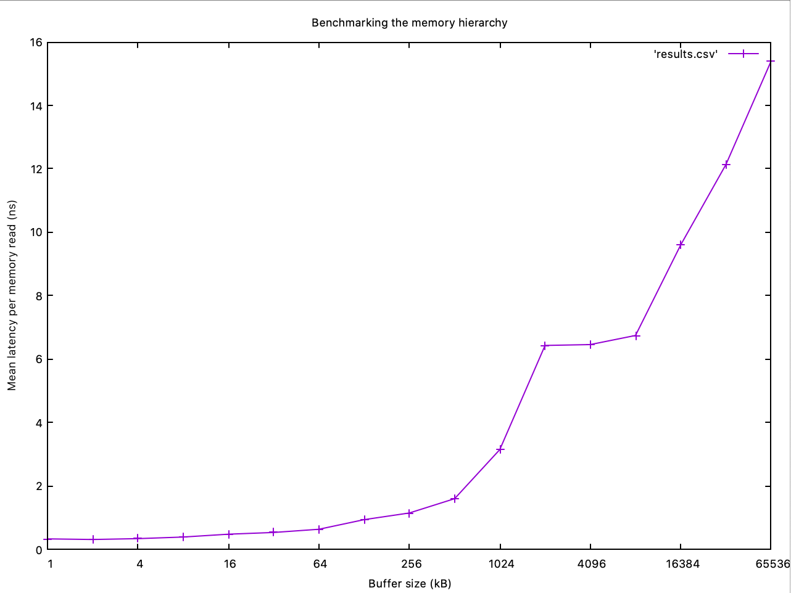

# HW1: Benchmarking the memory hierarchy
**Author: Hien Nguyen**

This repository contains a C++ program to measure the latency of reading a byte from memory out of a buffer of size N from 2^10 to 2^26.

To compile the program:
```
g++ -std=c++17 -O3 memory_benchmark.cpp
```
The optimization flag `-O3` is turned on to ensure your compiler produces the fastest code it can. Then run the program:

```
./a.out
```


## Part 1: Benchmarking

I measured the mean latency per memory read by looping as many times as the buffer size, each time randomly accessing a byte in the buffer. I took the minimum value of the mean latency through 10 iterations for each buffer size to get statistically stable measurements.

To foil the prefetcher from loading values to L1 or L2 caches, I created a array of random numbers within the range of the buffer size and used them as indices to read values from the buffer later. This is to prevent the prefetcher from trying to predict the memory access pattern within the loop.

While I tried to measure memory reads and little else, there were noises that might have interfered with my timing. While reading from the buffer is random, reading from the index array (in which I generated random numbers to use as indices for buffer access) is not. This means locality might have kicked in during timing; as a result, the prefetcher might have fetched extra memory from the L1 cache, adding to the latency.

Another potential source of noise might have come from the `volatile` variable `x` which I used to read memory at each loop iteration. The `volatile` specifier was set to tell the compiler, in optimization mode, to not get rid of this unused variable and put it in the main memory (instead of registers). The time the compiler took to write into the main memory for this variable might have also been factored in my latency measurements.

However, these noises were insignificant as the extra memory would have been fetched from L1.

Buffer size (KB) | Mean latency per memory read (ns)
-----|------------
1 | 0.334961
2 | 0.314453
4 | 0.341553
8 | 0.392578
16 | 0.48114
32 | 0.535797
64 | 0.637329
128 | 0.939392
256 | 1.14841
512 | 1.6003
1024 | 3.1495
2048 | 6.43035
4096 | 6.45975
8192 | 6.74561
16384 | 9.59886
32768 | 12.1375
65536 | 15.3987

## Part 2: Graphing


Figure 1: Graph of mean latency per memory read.

## Part 3: Analysis

1. From the graph, it looks like the L1 cache size ranges from 1-64 KB, as there is a noticeable jump right after the 64 KB mark, so it might be entering L2 cache there. From 64 KB to 512 KB there is a steady climb as the space complexity increases until a sharp rise right before 1024 KB mark, so my guess is that the L2 cache ends at around the 512 KB mark. By the same logic, since the next big jump happens right after the 8192 KB mark, we might be entering DRAM, which leaves the L3 cache size to be around 8192 KB.

Cache layer | Size (KB)
------------| ----
L1 | 64
L2 | 512
L3 | 8192

2. Compared to [these numbers](http://norvig.com/21-days.html#answers), I got similar numbers for the L1 cache (around 0.5 nanoseconds), but not L2 (around 1.5 nanoseconds compared to 7 nanoseconds). It might be because the processor was able to guess my access pattern to some degree and loaded values into L1 which made my L2 latency result significantly lower.

Despite the discrepancies, my results follow the same order of magnitude as those reported. The reason for the differences between my numbers and theirs might be due to having different CPUs. Another possibility is the reported numbers might be outdated information.  

3. I ran `sysctl -a` to get the system information on my computer. From the ouput,

```
hw.l1dcachesize: 32768

hw.l2cachesize: 262144

hw.l3cachesize: 4194304

```

I found that the cache sizes on my computer are **32 KB for L1, around 262 KB for L2, and 4 MB for L3**.

My guesses are close in the order of magnitude, but off by a factor of 2 (my guesses doubled the true numbers). My processor is Intel(R) Core(TM) i5-7360U CPU @ 2.30GHz.
